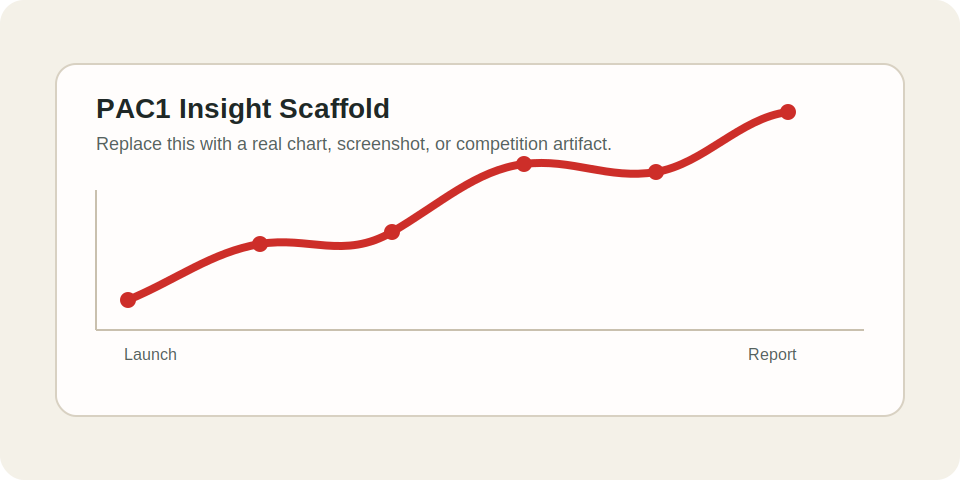

# Instructions to link architectures to BitGN: PAC1 Hall of Fame leaderboards!


(0) In order to share the architecture, it has to be written in English

(1) Name the file - `ACCOUNTID_architecture.md` e.g. `4jKiTS_codex-on-rails.md`

(2) populate YAML frontmatter fields with source code, run_ids (could be multiple). Examples are above in this file. author info is optional (you can stay anonymous).


YAML frontmatter is a section before MD that looks, for example, like this:


```md
---
source_code: https://github.com/inozemtsev/bitgn
run_ids:
  - run-22HmvyWoSiYowt3RLkz32TtGd
author: Igor Inozemtsev
author_linkedin: https://www.linkedin.com/in/igor-inozemtsev/
author_github: https://github.com/inozemtsev
company: Nevis
impact: Uses a frontier coding agent as the solver, while rails keep its runtime actions narrow and reliable.
challenge: PAC
---

# Codex-on-Rails: Code-Mediated Execution (PAC1)

Codex-on-Rails tied for first place in the most demanding part of the BitGN PAC1 blind run, alongside [Operation Pangolin](2026-04-18-pac1-winner-operation-pangolin.md).
...
```


You can add images by putting them into `res` folder and linking them like this: ``. They will render like this:



# Description format

When describing your architecture, please mention:

- how does it work?
- which LLM models did you use?
- Which problems did you encounter when designing your agent?
- How did you solve them?
- How do you think this agent could be made even better?
- Which things did you learn why building this agent?


# Please create PR adding your change

Subj. And then ping Rinat.

