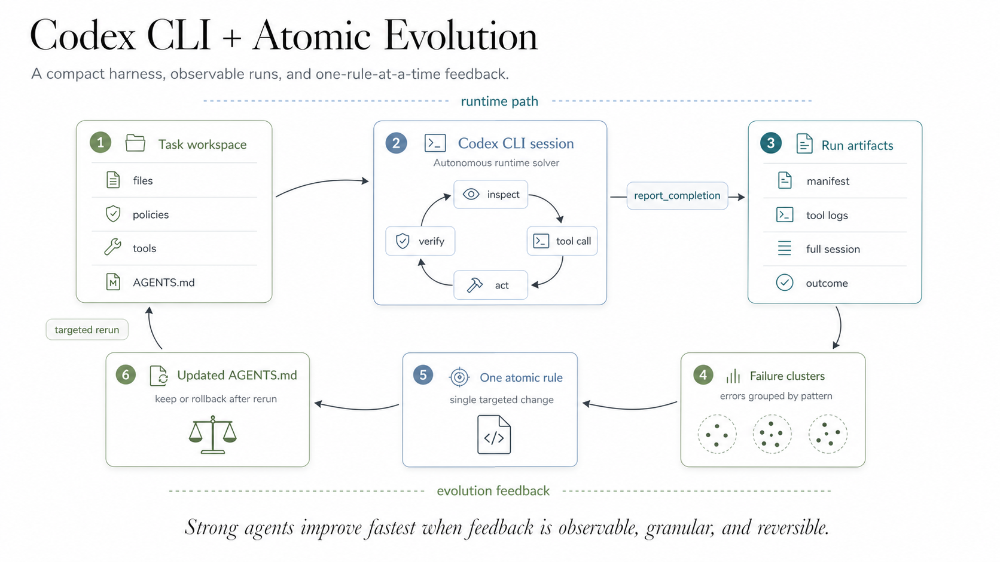

# Codex CLI + 100-Line Harness + Rules Evolution

This entry describes the architecture family behind my PAC1 blind runs `x021` and `x018`, which scored `84/104` on the ultimate leaderboard and `83/104` on the accuracy leaderboard. Later, the same setup also reached `104/104` in continued local evolution. The contest-day versions used a compact `AGENTS.md` harness of about one hundred lines. The repository has evolved beyond that exact snapshot, but the core idea stayed the same: keep the runtime solver simple, keep the action surface narrow, and move most improvement work into an explicit post-run evolution loop.

## How does it work?

The architecture has two main modules.

1. `codex-agent-native` is the runtime solver. It prepares one isolated workspace per task, launches one Codex CLI session per task, exposes only the benchmark-relevant tools through a Python wrapper, records all artifacts, and finishes the trial through the official completion contract.

2. `codex-agent-analytics` is better thought of as the ops/evolution layer. It reads failed task artifacts, groups failure patterns, proposes changes, applies one focused update at a time into a versioned rules snapshot, deploys the chosen version back into the native runner, and validates the result on targeted reruns before any leaderboard submission. Internally, this layer is not a single monolith. It is a sequence of agents or steps for analysis, change application, and deployment/validation.

Inside the runtime module, Python is intentionally not the planner. Python does orchestration only: task selection, workspace creation, task ordering, parallel execution, leaderboard trial lifecycle, artifact persistence, and tool dispatch. Codex CLI is the actual solver core. Each task is run as a Codex session that receives three things: the local rules, the task instruction, and the tool contract. From there, Codex decides which tool to call, in what order, and when to finish.

The harness itself is deliberately small and operator-controlled. Historically it was constrained to around one hundred lines of Markdown, and that constraint was useful because it forced the policy to stay sharp. The rules mostly define guardrails: how to inspect the repository, how to mutate files safely, how to select outcomes, how to verify authorization in sensitive tasks, and how to make sure `report_completion` is called exactly once with the right grounding references.

The biggest architectural choice is that the runtime and the improvement loop are separate. I did not want a self-modifying runtime that changes behavior while solving the benchmark. Instead, the runtime stays stable and observable, while a separate evolution step studies artifacts and proposes the next rules version.

Two additional design choices mattered a lot in practice.

- I treated rules evolution as atomic. One cycle should target one specific problem. If the agent is allowed to rewrite many things at once, you lose causality and rollback becomes much harder.
- I split code changes and rules changes. Early iterations really needed code-level fixes to stabilize the tool layer. After that, almost all progress came from policy evolution rather than further runtime rewrites.

One practical note: OpenCode was used mostly as my development cockpit, not as the deployed solver. The actual benchmark solver was Codex CLI.

## Which LLM models did you use?

- Main runtime solver: `gpt-5.3-codex`
- Runtime tiers explored: `low`, `medium`, `high`, and in some experiments `xhigh`
- Blind submission runtime: `medium`
- Rules evolution / analysis / deployer path: `gpt-5.3-codex high`
- `gpt-5.4` was tested, but for this benchmark it tended to spend more steps for roughly similar quality
- `xhigh` also did not justify itself well in my setup: noticeably more latency and token usage, but little quality gain over `high`

The key point is that I did not build a multi-model planning stack. I built around one strong coding agent and tried to make its environment disciplined enough that it could solve PAC1 reliably.

## Which problems did you encounter when designing your agent?

The first problem was a design trap around orchestration. Early on, Codex naturally drifted toward architectures that looked like the original Python `next-step` loop from the benchmark reference setup. That was not what I wanted. My goal was not "call Codex for one step, then call it again for the next step." My goal was "launch one Codex session per task and let it live inside its own loop until it decides to finish."

The second problem was rules drift. As soon as the harness started fixing one failure class, it could easily create regressions in another one. This was especially visible in inbox and authorization-heavy tasks, where a small wording change could improve one task and silently break several others.

The third problem was observability. Without full artifacts, it is very easy to tell yourself a comforting story about why the run failed. In reality, the failure usually comes from a very specific decision: wrong recipient resolution, one extra write, a missing grounding reference, a premature `OUTCOME_OK`, or a misread date anchor.

The fourth problem was evolution control. Wide rules edits created chaos. Once I allowed too many simultaneous changes, it became much harder to understand which change helped and which one introduced regressions.

The fifth problem was infrastructure reality. My server was relatively weak. When I pushed higher parallelism on OpenCode early on, the machine started to struggle. That forced me to take runtime footprint seriously much earlier than I expected.

Finally, PAC1 strongly tempts you to slip into benchmark-specific hacks. I wanted the policy to be reusable and defensible, not a collection of task-specific answers.

## How did you solve them?

I solved the `next-step` trap in a simple way: by inspecting the generated code directly and correcting the intent. Once I could clearly see that the generated architecture had drifted toward external step-by-step orchestration, I explicitly pushed it back toward the model I actually wanted: one Codex session per task, with full freedom to call tools until completion.

I solved rules drift and evolution instability by making evolution atomic. One cycle should target one problem. I also categorized failure patterns instead of treating them as a loose stream of symptoms. Each improvement proposal was tied to a specific error type or failure cluster, which made rollback and validation much more manageable.

I solved observability by making artifact collection a first-class feature. Every task attempt keeps the prompt snapshot, raw Codex session output, tool calls, submission payload, score file, run manifest, and task-relevant environment files. I wanted a real per-task run directory, not a vague summary. That makes it possible to diagnose concrete failure patterns instead of guessing.

I solved token waste mostly through run ordering rather than deep token optimization. The runner tracked which tasks failed more often, moved those tasks earlier in the queue, and stopped early on meaningful regressions. This reduced empty reruns and shortened the feedback loop.

I solved infrastructure pressure partly by choosing Codex CLI in the first place. On my weak server, its Rust runtime footprint mattered. In practice, that meant I could sustain noticeably more Codex sessions than OpenCode sessions on the same machine.

I solved blind-run discipline by pushing fixes toward general decision gates rather than task literals. The most useful rules were not benchmark trivia; they were reusable policies about ambiguity, authorization, exact output discipline, external side effects, entity resolution, and deterministic completion behavior.

Operationally, a lot of improvement also came from the run process around the model: targeted reruns first, risk-cluster validation second, full smoke runs after that, and leaderboard submissions only after local evidence was good enough.

## How do you think this agent could be made even better?

The biggest missing piece is a proper verification gate before final submission. Too many failures were caused by formally invalid but semantically almost-correct outputs, for example a path that was right in substance but missing a leading slash. That kind of check should not be left entirely to the model. It should be enforced in code on the tool layer before submission.

The second improvement would be a virtual mutation layer. I wanted a mode where the agent could stage and reason about intended file actions before actually sending them to the benchmark platform. That would reduce unnecessary writes, reversals, and other noisy mutations.

The third improvement would be an explicit scratchpad. In my view, the agent would benefit from a local draft file for temporary memory: initial facts, intermediate notes, things to double-check before completion. A stronger version of the same idea would be session-level memory across runs in the same local context.

## Which things did you learn while building this agent?

The most valuable lesson was simple: evolution has to be granular. If each evolution cycle changes one thing, you can understand the result, roll it back, and keep improving. If a cycle changes many things at once, the system may still improve, but you lose control over why.

I also learned how important it is to turn an agent into an operational process, not just a piece of code. Running the system on a separate server changed the whole workflow. I could start an evolution cycle from a phone, check results later, and keep the loop moving while I was away from my laptop. Compared to my previous ERC3 workflow, where many improvements passed manually through me, this felt like a real shift toward delegated iteration.

Another lesson was that the small `AGENTS.md` harness was not just a prompt file. It behaved more like a versioned operating policy for the solver: small diffs, rollback, targeted validation, and a bias toward general rules instead of task-specific hacks. That framing made the system much easier to evolve.

The project also improved my own way of working with agents. I became much more comfortable starting a new session, giving it context through `AGENTS.md`, `INDEX.md`, and related notes, and letting agents help operate several services in parallel.

Finally, I felt the practical freedom of frontier coding models much more clearly than before. In ERC3 I spent a lot of time squeezing local models. Here, a strong coding agent plus a compact harness carried a surprising amount of operational and implementation work.

## Repo / Links

- Source code: https://github.com/ai-babai/bitgn-env
- Architecture note in repo: https://github.com/ai-babai/bitgn-env/blob/main/ARCHITECTURE.md
- Active native rules: https://github.com/ai-babai/bitgn-env/blob/main/codex-agent-native/local-rules/AGENTS.md
- BitGN dashboard preview: https://preview.mipopkov.com/bitgn-dash/
