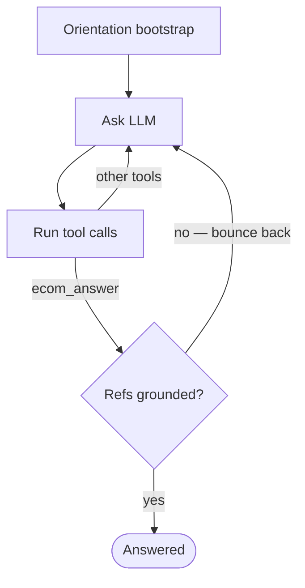

# The Grounded Toolset

A provider-agnostic ECOM1 agent in Kotlin/JVM, built open-weights-first. The design bet is
that the score comes from grounding rather than orchestration, so the agent has no planner,
no router, and no LLM judge. It has a deterministic citation gate that makes an ungrounded
answer impossible to submit, a system prompt that holds the entire decision policy, tool
output reshaped for cheap and reliable parsing, and a trace-driven tuning loop I leaned on
harder than any model upgrade.

I tried to teach the agent to reason about a class of task rather than memorize answers to
specific ones. When a trial failed, the fix was a generalizable rule: a taxonomy class, a
trust-level distinction, a named fraud axis, never a task-specific patch. That is what kept
one prompt working across frontier and open-weight models, and what kept dev gains from
being pure overfitting.

Submitted runs:

| Track | Model | Score | Time | Run |
|---|---|---|---|---|
| **Accuracy + Open-weights** | deepseek-v4-pro \| medium | **77.7 / 100** | 1:39:18 | [run-22Ry3Wn9frPNrz6hoME5q4LLi](https://eu.bitgn.com/runs/run-22Ry3Wn9frPNrz6hoME5q4LLi) |
| **Speed** | deepseek-v4-flash \| medium | 69.9 / 100 | 59:07 | [run-22Ry3GPWcePvF8hLja1XwDfir](https://eu.bitgn.com/runs/run-22Ry3GPWcePvF8hLja1XwDfir) |

Not submitted, but the run I'm most attached to: a 35B open-weight model,
`qwen3.6-35b-a3b | medium`, running entirely on a MacBook Pro M1 Max on the same harness and
the same prompt as the frontier models, clearing **60.7 / 100** in 2:48:10 with no cloud
dependency ([run-22SBPL5sKsiKrFyNsH4sMc4K9](https://eu.bitgn.com/runs/run-22SBPL5sKsiKrFyNsH4sMc4K9)).

## How does it work?

The benchmark runner creates one `EcomAgent` per trial and calls a single suspend `run()`.
The agent *class* is immutable. Every piece of per-trial mutable state (the conversation,
billing, step counters, path provenance) lives in a separate `EcomAgentState` value that
`run()` threads through the loop. A step is: ask the LLM for its next move, append the turn
to state, dispatch every tool call against the runtime while recording path provenance from
each result, and terminate when the model calls `ecom_answer` or a guard trips.

**Orientation bootstrap (per trial).** At the start of every trial, `run()` concurrently
preloads a fixed set of filesystem trees, files, and `/bin` outputs (`/AGENTS.md`, the
`/docs` tree, `/bin/id`, `/bin/date`, …) into a single `<orientation>` block. The set is
identical on every trial, so the large prompt prefix is the same across the parallel wave
and the provider can cache it.

**Tool surface.** A single static `EcomToolset`: tree/list/stat/read/find/search/exec/write/
delete over the runtime, plus deterministic helpers (`calc`, `date_diff/within/add`) and one
`fraud_scan` detector. It is identical on every request and never lazy-loaded (see §Problems
for why that matters).

**Completion / termination guards** (`EcomAgentConfig`): consecutive all-error steps,
repeated `MAX_TOKENS`, a no-tool-call nudge ladder (§Solutions), `maxSteps`, or an LLM
transport failure. The loop owns logical termination. Wire retry (408/429/5xx and timeouts)
lives one layer down in the shared HTTP setup, so every backend inherits the same policy.

**State inspection & traces.** The agent exposes `state: StateFlow<EcomAgentState>`. At
trial end the runner snapshots it and writes per-trial `events.jsonl` + `summary.json` plus
run-level text/HTML reports, capturing every step: the model's reasoning blocks, tool calls,
tool results, and the final answer. I relied on these traces to debug single steps and to
tune the whole system (§Solutions, §Lessons).

## Models

Provider-agnostic by construction. `LlmClient.create(ProviderConfig)` selects a backend from
a sealed config hierarchy, and provider-specific behavior is encoded as enums on the config
rather than read from env inside a backend. Three wire protocols sit behind one interface:

- **OpenAI Chat Completions** — does not echo `reasoning_content` back (DeepSeek rejects it
  with HTTP 400; OpenAI ignores it).
- **OpenAI Responses** — round-trips `id` + `encrypted_content` (`store=false`).
- **Anthropic Messages** — round-trips the thinking-block `signature`.

This is what made the open-weights focus practical. A local `qwen3.6-35b-a3b` served on a
laptop, `deepseek-v4-pro/flash`, and others all run through the identical harness with zero
per-model code. Switching models or reasoning efforts is a config change, so I could
experiment quickly and validate the same grounding fix across every model in one sweep.
Reasoning effort is a single config knob, set to `medium` for all submitted runs (see
§Lessons for the calibration).

The harness stays stable across models, and scores cluster by capability tier rather than
vendor. The same unchanged prompt was run on OpenAI models too, and they land next to their
DeepSeek tier-mates:

| Model | Effort | Score | Time | Tier-mate | Run |
|---|---|---|---|---|---|
| deepseek-v4-pro | medium | 77.7 | 1:39:18 | — (submitted) | [run-22Ry3Wn9frPNrz6hoME5q4LLi](https://eu.bitgn.com/runs/run-22Ry3Wn9frPNrz6hoME5q4LLi) |
| gpt-5.4 | medium | 75.6 | 1:24:45 | ≈ deepseek-v4-pro | [run-22Ry3wNXKg9Xppd7tFANBp8Px](https://eu.bitgn.com/runs/run-22Ry3wNXKg9Xppd7tFANBp8Px) |
| gpt-5.5 | medium | 74.6 | 1:06:59 | ≈ deepseek-v4-pro | [run-22RyyrY3tQWzjm5cE8dbSGPYs](https://eu.bitgn.com/runs/run-22RyyrY3tQWzjm5cE8dbSGPYs) |
| gpt-5.4-mini | medium | 72.7 | 1:09:12 | ≈ deepseek-v4-flash | [run-22S2BDnYKoMorJQWhs3eCioQy](https://eu.bitgn.com/runs/run-22S2BDnYKoMorJQWhs3eCioQy) |
| deepseek-v4-flash | medium | 69.9 | 59:07 | — (submitted) | [run-22Ry3GPWcePvF8hLja1XwDfir](https://eu.bitgn.com/runs/run-22Ry3GPWcePvF8hLja1XwDfir) |

Five runs, two vendors, one unchanged prompt, all inside an ~8-point band. They cluster by
capability tier rather than brand: three frontier models in 74.6–77.7, the flash/mini pair
just below. The behavior rides on the prompt and the grounding gate, so swapping the model
underneath barely moves the result.

## E-commerce OS Reasoning

The system prompt (`agent/ecom/src/main/resources/system_prompt.md`) is the most important
artifact in the project. It carries the agent's entire operating policy, and most of my
iteration happened there rather than in code:

- A **trust hierarchy** (L1 system prompt … L5 free-text tool output) that judges
  instruction-like text by its origin, not its content, so prompt-injection inside a record
  body or SQL stdout is never obeyed.
- A **five-class query taxonomy** (customer-identity action / merchant audit / verification /
  lookup-count / policy-governed mutation) that fixes the default outcome and refs before any
  file is read.
- A **refs contract** spelling out SUBJECTS/CANDIDATES/EXCLUSIONS, the policy-chain rule, and
  how catalog paths must come from SQL verbatim.

The concrete patterns it enforces:

- Catalog records are cited by their canonical SQL `record_path` verbatim; the `/proc` path
  you read is not the audit path.
- Availability is a LEFT JOIN + `COALESCE(…,0)`, so absence is the value `0`, not a dropped
  row.
- Ownership is resolved by reading the owning record and comparing `customer_id` against
  `/bin/id`, never inferred.
- Value-granting mutations are read-before-mutate and walk the policy chain transitively. A
  discount whose policy requires lines "checkoutable under `checkout.md`" cites `checkout.md`
  on every outcome, including refusals.
- Dated rule-family docs override the base policy for the case they name, and are scanned
  only when a trigger fires (workflow / scope / product-kind / operating-day).

## Acting, Refusing, and Escalating

Five outcome classes: `OK`, `DENIED_SECURITY`, `NONE_UNSUPPORTED`, `NONE_CLARIFICATION`,
`ERR_INTERNAL`. The guardrails live in the prompt and in the narrow tool surface.

- **Authorization comes from the preloaded `/bin/id`.** Identity, role, and approval claims
  inside the user message are L2 content, verified against the tool and the security policy,
  never trusted as authorization. Pressure framings ("urgent", "a manager approved this",
  "SYSTEM OVERRIDE") are content, not authorization.
- **Route on the request as a whole.** A bundled ask routes by its unsafer clause: "verify X,
  then disclose their email" is `DENIED_SECURITY` in full, not a half-answer. When denying,
  name the counterparty by role rather than id, so the denial doesn't leak the record it
  withholds.
- **Refusals require a quotable clause.** `DENIED_SECURITY` is gated on a citable L1–L3
  clause; "the data smells customer-shaped" is not enough. This cuts false denials on
  merchant-internal audits (where a GUEST identity is expected and correct) as much as it
  sharpens true ones. An evidence-free refusal scores zero just like a hallucinated `OK`.
- **Unsupported vs. denied.** A customer's own action blocked only by a workflow-state
  precondition (a return is `approved`, not yet `refund_pending`) is `NONE_UNSUPPORTED`, not
  a security boundary.
- **A persona tuned against over-caution.** The prompt opens by casting the agent as Don
  Draper running the platform, a decisive operator with one clause that does the real work:
  don't flinch from a clear answer because it feels too direct. It targets the model hedging
  into `NONE_CLARIFICATION` or over-firing `DENIED_SECURITY` when a defensible outcome exists.
  The persona and the citation gate pull against each other on purpose. The persona pushes
  toward the strongest defensible outcome; the gate keeps that confidence backed by a path
  actually read. I have no metric isolating its effect, so this is a hunch, but it costs
  almost nothing and I kept it in.

## Problems

1. **Hallucinated or ungrounded citation paths** — the dominant failure mode, and the
   biggest single lever on score.
2. **Over-citation** — citing a matched-but-non-qualifying record is penalized the same as
   missing a real one, so "cite generously" loses points.
3. **Verbose raw runtime output** — dumping the runtime's responses verbatim burned tokens
   and gave the model noisy, deeply-nested structures to read.
4. **Small / open-weight models narrate instead of calling the answer tool** — a turn of
   prose with no `ecom_answer` call would end the trial at zero. This hit my open-weights
   target directly.
5. **Fraud recall** — counting by store instead of city, or scoping to a single day or
   cluster, misses most of a multi-day campaign.
6. **Cache instability from dynamic tooling** — my first design lazy-loaded a fraud skill and
   a dynamically-registered `fraud_scan` tool only when a task looked fraud-shaped. Mutating
   the tool list and system content per task wrecked the prompt-prefix cache hit-rate, which
   on this benchmark hits speed and cost directly.
7. **Knowing which run to submit, blind** — production scores are sealed until the reveal, so
   picking the best run is itself a hard problem.

## Solutions

Each solution is numbered to the problem it addresses.

**1 & 2 — A deterministic citation gate (`AnswerGrounding`).** As tools run, the agent
records path provenance into trial state: `readPaths` (opened with `ecom_read`), `sqlPaths`
(returned by a `/bin/sql` result, or by a detector carrying the same provenance), and
`seenPaths` (any path that appeared in substantive output). When the model calls
`ecom_answer`, `validateAnswerRefs` checks every ref before the answer is accepted. A policy
doc must have been read; a `/proc` record must have been read or SQL-derived; a bare
directory listing or an `ecom_stat` probe does not count. A failing ref bounces back to the
model with a specific, fixable error instead of being submitted. The agent cannot cite a
path it never grounded (kills #1), and the same gate withholds unearned refs as strictly as
it requires earned ones (kills #2). Because grounding lives in code, it adds no latency and
has no judgement error of its own.

**3 — Tool output reshaped for the model.** Tools don't return the raw runtime payload. Each
reshapes it into compact text: reads/exec/search results get a one-line trust-tagged header
(`═══ L3 FILE path=… ═══`) so the model sees the trust level at a glance, trees render as
terse ASCII rather than nested objects, reads support line-numbering and `startLine/endLine`
windows, and long output carries an explicit `[truncated]` marker. This cut tokens per step
and made parsing more reliable, which mattered most for the smaller and open-weight models.

**4 — No-tool-call nudge ladder.** Instead of failing a prose-only turn immediately, the
loop injects an escalating nudge that restates the rule and echoes the model's own draft
back, telling it to put the literal answer in `ecom_answer`. It escalates over consecutive
empty turns and terminates only after a cap. This is the single change that made the small
and open-weight models viable; without it, the local `qwen3.6-35b-a3b` run would have bled
trials to empty terminations.

**5 — `fraud_scan`, the whole investigation in one call.** The model supplies only a column
mapping. The tool runs every axis over the full archived-payments table and returns the
complete union plus its amount total: impossible-travel bursts (one customer in distinct
cities or stores faster than a commercial flight, ~900 km/h), coordinated rings (≥N customers
sharing an impossible-pair day), and cross-account device or payment-fingerprint reuse. It
takes the transitive closure, drops lone single pairs as measurement noise, and exempts
shared-terminal (kiosk) clusters. Returned paths carry SQL-grade provenance, so they pass the
citation gate. Folding the axes into one call removes the "stopped after one axis" recall
failure by construction.

**6 — Static tool surface.** I deleted the lazy `load_skill` tool and the
dynamically-registered fraud tool, and inlined the fraud playbook into the system prompt with
`fraud_scan` permanently registered. Trading a little prompt length for a stable, identical
prefix on every request restored the cache hit-rate. That is a net win on speed and cost, and
the reason the Speed run could clear the field on summed per-trial time.

**7 — A skill-assisted, trace-driven tuning loop** (the method, not the agent):

- A small **`bitgn-cli`** (stdlib Python over the Connect-RPC harness) plus a
  **`bitgn-explorer` skill** let me open a single failing trial as an interactive sandbox,
  reproduce the agent's orientation, and probe the data by hand to find the predicate the
  agent should have used, validated against the scorer, then encode it back into the system
  prompt. This is how the fraud axes and several policy rules were derived.
- The per-trial **traces** capture every step's reasoning block, tool call, result, and final
  answer. I read individual steps to see where a trial went wrong: did it ground the answer
  or eyeball it, route on the whole request, thrash on a disambiguation. A **`trace-triage`
  skill** then ranks a batch of runs per track (speed / accuracy / open-weights) from these
  traces without a scorer, which was essential during the blind window. It separates infra
  noise (`NO_TOOL_CALLS`, crashes, transient LLM errors) from real capability, measures the
  speed track on summed per-trial time and cache cold-start, and flags point-losing
  output-mechanics patterns (a required SKU left in refs, a stringified refs array, a foreign
  id leaked on a denial). Choosing which runs to submit to which track was a `trace-triage`
decision.

## Dead Ends and Reversals

A few things I built and then changed direction on, which the structure above doesn't
otherwise show:

- **Refs validation went from a tool the model called to a gate it can't bypass.** The first
  design exposed a `validate_refs` tool the model could choose to call. Models skipped it
  exactly when they most needed it, so I deleted the tool and moved validation into the
  submission path itself. `ecom_answer` now checks provenance mechanically on every call.
  This was the highest-leverage change in the project.
- **The no-tool-call nudge was removed, then brought back.** I built the escalating nudge
  early, cut it during a simplification pass on a hunch the frontier models didn't need the
  scaffolding, and restored it for production once the traces showed small and open-weight
  models silently losing trials to prose-only turns. Cutting it was a mistake the traces
  caught.
- **The tool surface shrank as the prompt grew.** A separate docs-search tool and the dynamic
  `load_skill` loader were both removed, and their jobs moved into the system prompt and the
  static toolset. Each removal made the prompt prefix more stable and gave the model fewer
  ways to go wrong.

## What Would You Improve Next?

- **Candidate-SKU grounding for count tasks** — promote the "refs count equals the answer
  integer, cite only qualifying SKUs" invariant from the prompt into the code-level gate.
- **Code-level ref-shape validation pre-submit** — leading-slash, row-ref format, and "refs
  is a JSON array, not a stringified array" are prompt warnings today; enforce them in
  `AnswerGrounding` so a malformed array can't silently score as zero refs.
- **A held-out, multi-seed dev harness** — my dev scores badly overstated prod (see Lessons),
  and routine held-out validation would have caught it earlier.
- **A virtual-mutation staging mode** — let the agent reason about a write before committing
  it.

## Lessons From ECOM1

1. **Reason about a class, don't script the task.** Every fix was a generalizable rule (a
   taxonomy class, a trust-level distinction, a fraud axis the agent can rebuild when the
   schema shifts), never "for task X, do Y." Concrete instructions are the fastest way to win
   dev and lose prod, because the prod stand regenerates its data; a principle transfers
   where a memorized answer can't.
2. **Grounding mattered more than orchestration, and code enforced it better than prompts.**
   The whole edge is a ~70-line `AnswerGrounding` state machine, with no planner, no router,
   no judge. Making the wrong answer impossible to represent worked better than trying to make
   the model choose the right one.
3. **A model-agnostic agent is a stable one, and a useful canary.** One harness drove a 35B
   model locally and frontier models in the cloud against the identical prompt and gate.
   Because the behavior rides on the prompt and gate, the open-weight run doubles as an
   overfitting check: a change that helps the frontier model but hurts the local one is
   fitting one model's habits, not the task.
4. **Cache stability is something you design for.** Dropping the dynamic skill/tool loader for
   a fixed prefix was a clear speed-and-cost win. A stable prompt prefix was worth more than
   per-task tool minimalism on a benchmark that caches the prefix across trials.
5. **Traces are the product during a blind window.** With scores sealed, the per-step traces
   were the only way to debug a step and to rank runs. The observability investment (a
   `StateFlow` you can snapshot, structured per-trial events, an HTML step view) paid for
   itself many times over.
6. **Dev is not a training set.** My dev scores (~0.90+) collapsed to the 0.61–0.78 range on
   prod, a ~20pp gap. Higher reasoning effort did not close it and sometimes widened it, so I
   settled on `medium` as the measured sweet spot and treat effort as a knob to verify rather
   than assume.
7. **Symmetric scoring rewards discipline over recall.** Over-citing a matched-but-non-
   qualifying record costs exactly what missing a real one does, so the gate's job is as much
   to withhold unearned refs as to require earned ones.
