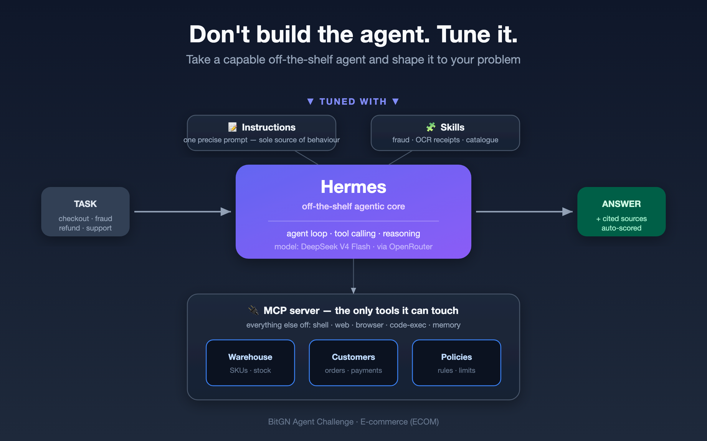

# Tuned Hermes: An Off-the-Shelf Agentic Core Shaped to ECOM1

This writeup describes the architecture behind my ECOM1 PROD runs. The guiding principle was the opposite of building a bespoke agent: I took a capable off-the-shelf agentic core (**Hermes**) and tuned it to the e-commerce world with a precise prompt, a few narrow skills, and a single tightly-scoped tool surface. Everything the agent does — checkout, fraud, refunds, support, catalogue counting — runs through the same disciplined loop.

The system runs on **open-weight DeepSeek V4** models only (Flash by default, Pro routed to a hard task cluster), served via OpenRouter. The journey on the PROD board went from **45.4%** (first blind baseline) to a **78.7% mean / 81.1% peak**, while cutting cost per run by roughly an order of magnitude versus the pro-only baseline.

## How does it work?

There is one runtime loop and almost no custom orchestration code. A thin Python runner connects to the benchmark harness, pulls each task, optionally picks the model (see Models), and launches **one Hermes session per task** in one-shot mode. Hermes owns the agent loop, tool calling, and reasoning; my code only handles task lifecycle, parallel workers, artifact capture, score polling, and the grounding-reference post-processing.

- **What starts a task?** The runner receives a trial (instruction + harness URL) and spawns a Hermes subprocess with an isolated `HERMES_HOME`.
- **What context does the agent get?** A single precise system prompt (security fast-path, outcome/refusal rules, and the grounding-reference protocol) plus the task instruction. The prompt is treated as the sole source of behaviour — not a pile of task-specific hacks.
- **Which tools can it call?** Only the `bitgn-ecom` MCP server (see below). All 24 built-in Hermes toolsets — shell, web, browser, code execution, vision, memory, messaging, etc. — are explicitly disabled. The action surface is deliberately tiny.
- **How does it inspect state before acting?** Through read/list/find/search/stat tools and a sandboxed `exec` for the VM's own binaries (notably `/bin/sql` for structured queries against catalogue and records).
- **How does it decide it's finished?** It commits a final answer with a set of cited grounding references; the platform scores it deterministically.

The big architectural bet: keep the runtime stable and observable, and put all the "intelligence about the domain" into the prompt + skills + tool scoping, rather than into a multi-model planning stack.

## Models

Everything is **open-weight DeepSeek V4** via OpenRouter — no proprietary frontier model anywhere in the stack.

- **Main solver (default):** `deepseek-v4-flash` — handles the bulk of tasks (shopper, checkout, support, OCR, policy) well and cheaply.
- **Hard-cluster solver:** `deepseek-v4-pro` — routed in only for the task types Flash systematically fluffs.
- **Router:** a lightweight regex over the task instruction (no extra LLM call). If the instruction matches the count / resolve / availability / fraud-archive cluster — phrases like *"how many"*, *"resolve this product request"*, *"does … exist"*, *"… units available"*, *"impossible travel"*, *"fraud"* — the task is sent to Pro; otherwise it stays on Flash. About a quarter of tasks route to Pro.
- **Runtime settings that mattered:** one-shot Hermes session per task; isolated home with built-in toolsets off; deterministic refs post-processing.
- **All open-weight/local?** Yes. Both models are open-weight DeepSeek V4 — the whole system is open-weights.

The lesson here mirrors the diagram's title: I did not need a bespoke multi-model brain. One strong open-weight model with a disciplined environment carried most of the work; a stronger sibling on a narrow cluster closed the rest of the gap.

## E-commerce OS Reasoning

The agent reads the e-commerce OS through the `bitgn-ecom` MCP server — a small FastMCP stdio server exposing `tree / list / read / read_silent / write / delete / find / search / stat / exec / context`. The `read` tool double-duties as a grounding-reference tracker (every read path is recorded), while `read_silent` lets the agent browse without polluting the citation set.

- **Catalogue & product matching:** structured `/bin/sql` queries over `product_variants`, with SKU canonicalisation to `product_variants.record_path` so non-canonical catalogue paths don't break counts. A dedicated catalogue-reporting skill follows dated policy docs to count distinct in-stock SKUs by kind, store scope, and inventory filter.
- **Inventory, warehouses, shipping, store coverage:** counts respect store open-status and per-store same-day availability, deduplicating SKUs across stores.
- **Customer records, baskets, orders, payments:** discovered via SQL and structured reads; baskets and dispatch plans found through SQL (not file reads) are explicitly trusted as evidence.
- **Merchant policies & addenda:** the agent resolves the *dated* policy update that applies to "today" before counting or deciding.
- **Support tickets, returns, refunds, escalations:** handled by the general loop under the prompt's outcome/refusal rules.
- **Audit trails, logs, evidence:** every task attempt keeps full artifacts — prompt snapshot, raw session output, tool calls, submission payload, score file — so failures can be diagnosed precisely instead of guessed.

Two domain skills sharpen specific corners:

- **OCR receipt skill:** when a task references a scanned receipt and asks whether today's pre-VAT total stays within a EUR threshold, the skill recovers OCR-corrupted SKUs via character-class fuzzy matching (0↔O, 1↔I↔L, 5↔S, 8↔B…), re-matches them against `product_variants` (exact → GLOB → brand+model), and re-prices against the *current* catalogue rather than the printed price.
- **Fraud-forensic skill:** activates only on genuine Risk-Ops/chargeback tasks and runs five independent detectors (impossible-travel velocity by **city** and day-bucketed, rapid-fire single-device bursts, cross-customer device sharing, shared payment methods, identical fingerprint pairs), then unions and dedupes the clusters.

## Acting, Refusing, and Escalating

Guardrails live in the prompt and in the narrow tool surface, not in special-case code.

- **When may it mutate state?** Rarely, and only through the explicit `write`/`delete` MCP tools; the prompt biases hard toward read-and-decide over write.
- **How does it verify authorization?** Through identity/role context (`/bin/id`, `context()`) and policy lookups before any sensitive action; the security fast-path in the prompt makes the agent check authorization before acting on a request.
- **How does it handle pressure** (a demand for an unauthorized 99% discount, a refund outside policy, a checkout-control bypass)? It treats the policy book as the source of truth and refuses or escalates rather than complying under pressure.
- **When does it refuse / clarify / escalate?** When the policy doesn't permit the action, when identity/authorization can't be established, or when the task is genuinely ambiguous.

## Problems

- **Massive dev→prod overfit.** Dev scoring read ~95.8%, but the first blind PROD run was 45.4% — a ~40pp gap. I had effectively been tuning on the dev split as if it were a training set.
- **Over-citation was the #1 killer.** The agent browsed sibling catalogue files and cited all of them; the grader wanted the minimal grounding set tied to the answer. Correct answers scored 0 purely on bloated references.
- **High PROD variance.** ~30% per-run task churn meant single-run deltas under ~5pp were just noise — easy to fool yourself with a lucky run.
- **An opaque grader wall on inventory-count tasks** that both Flash and Pro fail identically — not a model-capability problem.
- **Fraud recall**, not counting, was the real fraud failure mode early on (counting *stores* instead of *cities* diluted impossible-travel bursts).

## Solutions

- **Trust the model's own references.** Instead of submitting the full server read-set, I filter the model's own `read` calls down to paths the server actually touched and submit *those*. This single change took PROD from 45.4% → 67.8% (+22.4pp) and made the run ~9× cheaper by also enabling the Flash default.
- **But don't over-drop real entities.** SQL-discovered baskets/payments/dispatch plans don't show up as file reads, so I additionally trust non-catalogue `/proc` entries (with a real file extension) and `/ops` paths — while still filtering `/proc/catalog/` siblings to keep the over-citation guard. This recovered always-zero checkout-clarify tasks (+2.1pp, structural).
- **Route the hard cluster to Pro.** A cheap regex sends only count/resolve/availability/fraud tasks to `deepseek-v4-pro`, lifting the mean to 78.7% (peak 81.1%) while keeping ~3/4 of tasks on cheap Flash.
- **Measure on multiseed, accept only Δ>σ.** After the overfit lesson, I stopped trusting single-run peaks and only accepted structural changes that beat the noise floor across seeds.
- **City-based, day-bucketed fraud detection** fixed impossible-travel recall.
- **Kept it simple on purpose:** one Hermes session per task, one prompt, no self-modifying runtime, deterministic refs post-processing.

## What Would You Improve Next?

- **Candidate-SKU grounding for count tasks.** The last wall (inventory-count) looks like the grader expecting references on the *qualifying SKUs* named in the instruction, not just store-level refs. That's a structural protocol change worth testing — carefully, so it doesn't become a dataset-specific hack.
- **A code-level verification gate before submission** — formal checks (path shape, leading slash, output format) that shouldn't be left to the model.
- **A staged "virtual mutation" mode** so the agent can reason about intended writes before they hit the platform.

## Lessons From ECOM1

- **Dev is not a training set.** The biggest mistake was tuning against the dev split until it overfit; a held-out, multiseed dev split would have caught most of my "improvements" as grader-strictness artifacts cheaply.
- **The cheapest, biggest win was discipline, not capability.** Over-citation — a grounding-reference hygiene issue — cost more points than any model swap. Trusting the model's own minimal reads beat throwing a bigger model at the problem.
- **Tune, don't build.** A stock agentic core plus a precise prompt, a tiny tool surface, and a couple of narrow skills got most of the way; selective routing closed the rest. You can go a long way on open-weight models alone.
