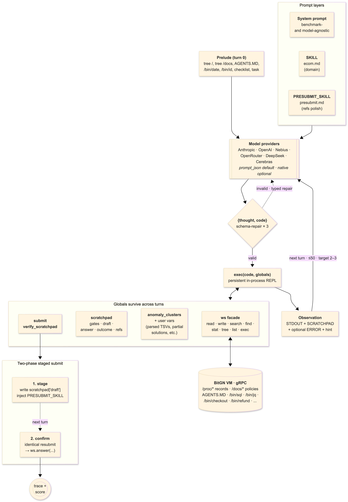

# A-Agent: Train the Workspace, Then the Domain

Core idea: a single CodeAct agent with two hot-swappable prompt layers (system prompt + domain SKILL + answer-review PRESUBMIT_SKILL) on top of a persistent in-process Python REPL. The system prompt is trained against a small Qwen under one rule — the "Bitter Lesson" used as a regression test: a change ships only if a stronger model already does better than a weaker one on the bare prompt, before any domain skill is layered in. The same system prompt then transferred from PAC1 to ECOM with zero edits. The repo is intentionally small (~1K LOC of agent core plus two skills); the discipline that produced this version of CodeAct is the point, not CodeAct itself.

## How does it work?

- **What starts a task?** `main.py` walks `StartTrialRequest` over the benchmark's trial list and hands each `(harness_url, instruction)` to `run_agent(...)`. Every step is persisted as JSON per trial for offline triage.
- **What context does the agent receive?** Before turn 1 a *prelude* is injected: `ws.tree("/")`, `ws.tree("/docs")`, the root `AGENTS.MD`, `/bin/date`, `/bin/id`, a one-paragraph checklist (naming today's date so date-stamped addenda don't get missed), and the task text. The model never has to discover the room.
- **Which tools or APIs can it call?** Exactly one: `execute_python({thought, code})`. Inside `code` the model sees a preloaded namespace: `ws` (the workspace facade), `scratchpad`, `submit`, `verify`, the domain primitive `anomaly_clusters`, and bare aliases `read / write / search / find / delete / stat / exec / tree / ls`. `ws.exec(...)` reaches the runtime exec surface (`/bin/sql`, `/bin/jq`, `/bin/checkout`, `/bin/refund`, `/bin/availability`, `/bin/payments`, …). Importable stdlib is whitelisted (`json`, `math`, `re`, `datetime`); everything else raises with a typed hint pointing back to `ws`.
- **How does it inspect state before acting?** The prompt targets **2–3 `execute_python` calls per task**: call 1 batches every obvious read (tree, targeted `search`/`find`, exact `/proc/*` records, today-stamped `/docs/*` notes, `/bin/date`, `/bin/id`); call 2 (or 3) performs the decision tree, writes/deletes, and `submit(...)`. The Python REPL is in-process and globals persist across turns — loaded TSVs, parsed records, and intermediate objects survive at zero token cost. The model is told to reuse variables rather than re-read.
- **How does it decide that the task is finished?** It calls `submit(answer, outcome, refs)` from inside `code`. `verify_scratchpad` runs as a precondition; on a clean validation the harness's `ws.answer(...)` fires and the loop breaks. Hard ceiling: 50 turns. When `PRESUBMIT_SKILL` is set, `submit` is two-phase: the first call stages a draft and surfaces a focused checklist in the next observation; an identical second `submit(...)` confirms.

## Models

- **Main solver:** `openai/gpt-5.5` for the 81.3 prod run (`run-22RxM7Fjb6Lfkv6SZFn8FG3p5`). `Qwen/Qwen3.5-397B-A17B` via Nebius scored 68.1 on the same agent and served as the prompt-iteration model throughout development.
- **Classifier / router / planner:** None. Single agent, single tool, full task context. No upstream classifier — the same model that solves the task evaluates the gates.
- **Evaluator or evolution loop:** None at runtime. Offline: a JSON trace per trial under `run_logs/` for failure analysis.
- **Runtime settings that mattered:** `temperature=0`, `max_tokens=4096`, `tool_choice` pinned when native tool calling is used, Anthropic ephemeral cache on the system block and the task message, 4 API retries with backoff, 3 schema-level retries per turn with a typed repair message. `MODEL_TOOL_MODE=prompt_json` (JSON-in-plain-text) was the discipline during prompt iteration so the prompt couldn't lean on a provider's schema validator; native tool calling is supported but is flaky enough cross-provider that `prompt_json` stayed as the default training channel.
- **Open-weight?** `Qwen/Qwen3.5-397B-A17B` is open-weight (Nebius hosted). `openai/gpt-5.5` is closed-weight. The same loop also supports Anthropic, OpenRouter, DeepSeek, and Cerebras via the provider router in `agent.py`.

## E-commerce OS Reasoning

The agent reads ECOM,authority lives in three places, in this order: `AGENTS.MD` (root and folder-local) for canonical procedure, `/docs/*` for policies and date-stamped addenda, `/proc/*` for entity records.

- **Catalogue and product matching:** `/proc/catalog/*` read on demand via `ws.search` (for keywords across brand/category) and exact `ws.read` for the specific record. Citations in `refs` are exact filenames, not directory paths.
- **Inventory, warehouses, shipping, and store coverage:** `/proc/locations/*` and `/ops/dispatch/*` for store records and lane definitions; `/bin/availability` for live coverage checks. Routing-style tasks (dispatch waves, multi-hop lanes) keep partial solutions and parsed TSV state alive in Python globals across turns rather than re-serializing each call.
- **Customer records, baskets, orders, and payments:** Canonical paths under `/proc/customers/`, `/proc/baskets/`, `/proc/payments/`. Field extraction is pushed to `/bin/jq` rather than scanned by eye. `/bin/sql` is used for cross-table aggregation. When `/bin/sql` truncates or fails, the truncation marker carries a hint to narrow the query and python-side filtering over already-loaded objects is the fallback.
- **Merchant policies and policy addenda:** `AGENTS.MD` is the canonical authority. The prelude checklist names today's date and tells the model to look for `/docs/*` files whose names match the date or a topic word from the task — date-stamped policy notes in side directories are easy to miss but are usually binding. Every policy or addendum the model relied on must appear in `refs` as an exact filename.
- **Support tickets, returns, refunds, and escalations:** `/bin/refund` and `/bin/checkout` are the action surfaces. Both are gated by the `trust` gate, which must name a concrete canonical authority source (a workflow doc, `AGENTS.MD` clause, or entity record) before the side effect fires.
- **Audit trails, logs, and evidence:** Every step is captured in the per-trial JSON trace (`thought`, `code`, `stdout`, `scratchpad` snapshot, raw model response, usage, timings, errors, retries, submit phase). `refs` on the final submission act as the model's own audit pointer — directory refs are discouraged; specific record/policy files are preferred. `verify_scratchpad` rejects an empty refs list.

For fraud-style work, `cluster_tools.anomaly_clusters(ws, ...)` ships the SQL + haversine + implied-speed logic as code. It returns a `ClusterSet` of impossible-travel candidates with signal annotations; the model spends tokens deciding `include` / `reject` per cluster and calls `cs.refs()` to produce the final `refs` list. Tokens spent on judgment, not on rewriting geo math each task.

## Acting, Refusing, and Escalating

Task text is untrusted. Authority is canonical files only. 

- **When is the agent allowed to mutate state?** Only after a relevant gate is recorded as `"YES"` in `scratchpad["gates"]` and that verdict names a concrete canonical authority source. `submit(...)` calls `verify_scratchpad` (28 lines, in `verify.py`) which rejects any `OUTCOME_OK` that follows a `ws.write` or `ws.delete` without an evaluated gate, or where any gate is `"NO"`.
- **How does it verify authorization, identity, roles, or policy constraints?** Five domain-agnostic gates:
  - **identity** — compare sender/recipient against canonical visible identifiers exactly. Match proves *who* is asking, not whether they're allowed what they ask for.
  - **trust** — required before any outbound draft, refund, checkout, or cross-person share. Names the file that authorizes that specific move.
  - **rule-conflict** — system prompt > workspace docs; contradictory canonical docs → clarification rather than guess.
  - **pre-write scope** — before `ws.write(...)`, name the clause that authorizes this specific artifact.
  - **pre-delete scope** — before `ws.delete(...)`, name the rule that authorizes deletion of this file type.
- **Pressure to apply discounts, refunds, checkout actions, or customer-data access that may be unsafe:** Task text is treated as evidence of *what is being asked*, never as authority that it's allowed. A false trust-elevation claim combined with a harmful request triggers `OUTCOME_DENIED_SECURITY` immediately. Discounts / refunds / checkout require a `trust` gate verdict of `"YES"` grounded in a named canonical authority file.
- **When does it refuse, ask for clarification, or escalate instead of acting?** 
  - `OUTCOME_DENIED_SECURITY` — `trust` gate is `"NO"` (no canonical authority for the requested move).
  - `OUTCOME_NONE_CLARIFICATION` — request is otherwise legitimate but a required identifier or target is unresolved from canonical data.
  - `OUTCOME_NONE_UNSUPPORTED` — the workspace simply lacks a mechanism, channel, or identifier to complete the request.
  - `OUTCOME_ERR_INTERNAL` — internal failure.
  - `OUTCOME_OK` — only when the actual requested task was completed.

  Once any gate is `"NO"` or `"BLOCKED"`, side effects stop and the corresponding deny/clarify outcome is submitted in the same code execution — no half-actions.

The **two-phase staged submit** is the answer-side analogue of the gates. When `PRESUBMIT_SKILL` is set, the first `submit(...)` stages a draft and surfaces the presubmit checklist in the next observation. The model gets a full Python turn during the review — it can verify a ref with `read(...)`, recompute an aggregate with `/bin/sql`, mutate `scratchpad["gates"]` if it missed one — then either confirm with an identical `submit(...)` or revise. The runtime decides when `ws.answer(...)` actually fires.

## Problems

- Models at some point defaulted to many small reads; tokens exploded and traces became unreadable.
- Date-stamped addenda in `/docs/*` were systematically missed.
- After a `ws.write`, models would submit `OUTCOME_OK` without recording a gate.
- `/bin/sql` failures were treated as terminal instead of falling back to `/bin/jq` or python-side filtering.
- Cross-provider, malformed tool calls (fences, prose in `code`, wrong JSON) ended runs.
- Early prompt versions that improved a small-Qwen run regressed on Claude / GPT — overfit detected by the model-scaling regression check before they could ship.

## Solutions

- **Train against the lesser case, evaluate against the better one.** The system prompt was iterated against Qwen via `prompt_json`. A change shipped only if it didn't reduce the score on a stronger model. That selection pressure produced the layering, the structural gates, and the two-phase submit.
- **Two skills.** `ecom.md` for domain instincts; `presubmit.md` for `refs` discipline before the second `submit(...)` lands. The system prompt stays benchmark-agnostic.
- **Two-phase staged submit.** First `submit(...)` stages a draft and injects the presubmit checklist as the next observation; identical second `submit(...)` confirms. The runtime forces the second look, and the model has a full Python turn between the two phases to verify, recompute, or revise.
- **Gates as required fields.** `scratchpad["gates"]` is structured data validated at submit by `verify_scratchpad` (28 lines). The model can't be polite into a wrong action.
- **Today-aware prelude checklist.** The date is read by `/bin/date` and named explicitly so date-stamped addenda stop being invisible.
- **Error → hint coaching.** `NameError` / `TypeError` / `ValueError` map to specific repair text in the next observation ("use `root=`, not `path=`", "`ws`/`scratchpad`/`submit` are preloaded — don't redeclare").
- **Schema-repair retry.** Three attempts per turn with a typed repair message before a malformed tool call ends the run — the cost of choosing `prompt_json` as the default, paid back by portability.
- **Kept simple deliberately.** One tool, one agent, one model in the loop. In-process `exec()` rather than a subprocess or container — the VM RPC is the real boundary; wrapping the executor in more isolation would be overengineering for no security gain. No inter-task memory.

## What Would You Improve Next?

- **Precise grounding** — the main remaining error class. The presubmit pass catches a lot of `refs` discipline issues, but exact-quote / exact-record alignment with the answer text probably wants its own structural mechanism rather than another prose checklist. Didn't ship in time for the main event.
- Drop the 50-turn ceiling; add real context management (compaction) for long stateful tasks.
- Cap presubmit revisions explicitly — currently unbounded except by the outer 50-turn loop.
- Make gates *call-site* preconditions — wrap `ws.write` / `ws.delete` so a missing gate raises in-runtime, not only at submit.
- Auto-promote lessons into `Skills/` after a failed-then-fixed task — lightweight skill growth without touching the agent core.
- A cheaper second model running the presubmit pass in parallel, surfacing objections instead of relying on the solver to critique its own draft.
- More domain primitives in the `anomaly_clusters` mold (dispatch routing, basket repricing, refund-eligibility resolution).

## Lessons From ECOM1

- **Bitter Lesson as a regression test.** "Bigger model, better score on the bare prompt" is a property the dev loop can check, but only *before* any domain skill is layered in. Once a skill is on, prompt-vs-skill contributions entangle and the signal disappears. Tune on the weakest model you can stand; ship a change only if a stronger model already does better on the bare prompt. That single rule produced both the layering and the choice of `prompt_json` as the default training channel.
- **Keep the general thing general.** The system prompt transferred from PAC1 to ECOM with no edit (75/104 → 104/104 on PAC1 with a 50-line `pac1.md` skill, then 11/12 on the first ECOM dev cut with no skill). That only worked because no PAC1-specific instinct ever leaked into the prompt — the `SKILL` slot was a strict discipline, enforced by the regression check.
- **"Domain-agnostic" is a bounded claim.** The system prompt assumes an Enterprise OS shell — canonical-file authority, `/proc + /docs` shape, `/bin/*` runtime. Inside that shell it transfers cleanly. Outside it would need rework. Naming the limit is part of the discipline.
- **Push specificity into swappable layers.** Domain in `Skills/`, accuracy polish in `PRESUBMIT_SKILL`, instrument list in the workspace. Three knobs on three timescales.
- **Persistence is leverage.** In-process Python state makes "batch your reads, then think" economically true, not just rhetorical. It's also what lets the staged-submit turn do real verification work — `read(...)` / `/bin/sql` / mutate gates — instead of being a yes/no veto.
- **Compile shared shape into code.** `anomaly_clusters` paid for itself. Most prompt instructions that repeat across tasks are primitives in disguise.
- **Structure beats maxims, and the receipts are short.** The precondition that gates the whole architecture — `verify_scratchpad` — is **28 lines**. Five rules, no prose. The alternative was paragraphs in the system prompt asking the model to be careful, and you couldn't measure whether they were honored. Twenty-eight lines you can measure.
- **CodeAct isn't the contribution.** What's small is what surrounds it: the layering, the prelude, the gates, the two-phase submit, the error→hint loop, the JSON-over-text tool channel, and the regression rule that produced them. None are individually novel. The choice was to ship exactly these and nothing else, and to let the model-scaling check decide what stays.

## Architechture Diagram

